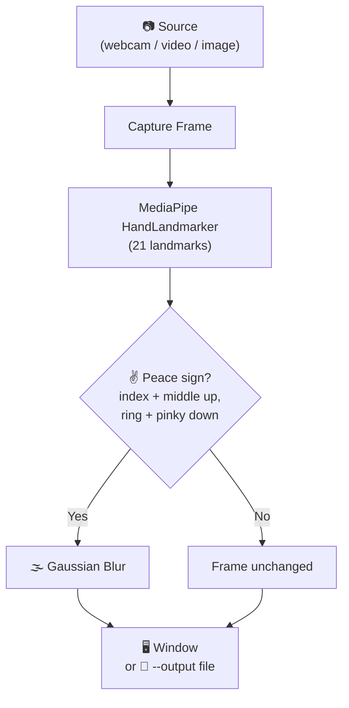

# ✌️ Peace-to-Blur

> Throw up a peace sign, disappear into a blur.

**Peace-to-Blur** is a tiny computer-vision toy: it watches your camera, and the moment you flash a **✌️ peace / victory sign**, the whole frame goes soft and blurry. Drop the sign, and you snap right back into focus.

It works on **Linux, macOS, Windows, and WSL2** — and runs happily on modest hardware with no GPU required.

---

## ✨ What It Does For You

*   **✌️ Real-time peace-sign detection:** Uses MediaPipe's hand-landmark model to read your finger pose live from the webcam, frame by frame.
*   **🌫️ Instant blur, instant focus:** Blurs the frame the moment a peace sign appears and clears it the moment you drop the pose — no buttons, no delay.
*   **📦 Self-contained — no manual model setup:** The hand-landmark model (`hand_landmarker.task`, ~7 MB) **downloads automatically** on first run into `./models/`. Nothing is installed system-wide.
*   **🎥 Works with more than just webcams:** Point it at a webcam, a video file, or a single image — same command, just change `--source`.
*   **🖼️ Headless-friendly output:** No display? Write the blurred result straight to a video or image file with `--output` — great for servers, SSH, and CI.
*   **🐧 First-class WSL2 support:** Full `usbipd-win` camera-passthrough instructions included, and GUI windows work out of the box on WSLg.
*   **📝 Clean logging with Loguru:** Every step — model load, source open, file writes, errors — is logged clearly so you always know what's happening.

---

## 🎬 How It Works

When you run peace-to-blur, each frame flows through these steps automatically:

1. **Capture** — grab a frame from the camera (or a video/image file).
2. **Detect** — run MediaPipe's `HandLandmarker` to find the 21 hand landmarks.
3. **Classify** — check the finger pose: index **up**, middle **up**, ring **down**, pinky **down** → that's a peace sign.
4. **Blur** — if detected, soften the frame with a Gaussian kernel.
5. **Show or save** — display it in a live window, or write it to a file with `--output`.

The detection logic lives in `is_peace()` — it simply compares each fingertip's height to the knuckle below it.



---

## 📋 Requirements

| Requirement | Version | Notes |
|---|---|---|
| **Python** | 3.11 or newer | [python.org/downloads](https://www.python.org/downloads/) |
| **Webcam** | — | Optional — you can feed it a video or image file instead |

Runtime dependencies (`opencv-python`, `mediapipe`, `loguru`) install from `requirements.txt`. The hand-landmark model downloads itself on first run.

---

## 🚀 Install & Run

```bash
python -m venv .venv
source .venv/bin/activate
# On Windows: .venv\Scripts\activate
pip install -r requirements.txt
python peace-to-blur.py
```

By default it opens a live window. Flash a ✌️ at the camera and watch the blur kick in. Press **ESC** or **close the window** to quit.

---

## 🕹️ Usage

```
python peace-to-blur.py [--source SOURCE] [--model MODEL] [--output OUTPUT]
```

| Flag | Default | What it does |
|------|---------|--------------|
| `--source` | `0` | Webcam index (`0`, `1`, …) **or** a path to a video/image file |
| `--model`  | auto | Path to a `hand_landmarker.task` file (skips the auto-download) |
| `--output` | —    | Write the result to this file instead of opening a window |

### Examples

```bash
# Live webcam window (default)
python peace-to-blur.py

# Use the second camera
python peace-to-blur.py --source 1

# Process an image, save the result (no window — great for headless/servers)
python peace-to-blur.py --source selfie.jpg --output blurred.jpg

# Process a video file
python peace-to-blur.py --source clip.mp4 --output clip-blurred.mp4
```

---

## 🐧 Running on WSL2

WSL2 doesn't see your webcam by default. Here's the full path to get it working.

### Step 1 — Pass the USB camera through with `usbipd-win`

Run every Windows step in **PowerShell as Administrator**. Make sure your WSL2 distro is **already running** (open a WSL terminal) before you attach.

**a. Install usbipd-win** (then reopen the Admin PowerShell so it's on PATH):

```powershell
winget install usbipd
```

**b. Find your camera's BUSID** — look for "Integrated Camera", "USB Video Device", "HD Webcam", etc. and note its `BUSID` (e.g. `2-4`):

```powershell
usbipd list
```

**c. Bind it** (one-time per device — marks it shareable):

```powershell
usbipd bind --busid <BUSID>
```

**d. Attach it to WSL2** — this is the command that hands the camera to WSL:

```powershell
usbipd attach --wsl --busid <BUSID>
```

> The attach does **not** survive an unplug, reboot, or `wsl --shutdown` — re-run this `attach` each time. To auto-reattach when the device reappears, add `--auto-attach` and leave that PowerShell window open.

**e. Verify inside WSL2:**

```bash
ls /dev/video*                   # should list /dev/video0, etc.
sudo modprobe uvcvideo           # if it doesn't show up yet
```

**f. When you're done**, return the camera to Windows (optional):

```powershell
usbipd detach --busid <BUSID>
```

### Step 2 — Display

The live window needs a display. Modern WSL2 ships **WSLg**, so GUI windows just work (`echo $DISPLAY` should print something like `:0`). If you're on a headless setup or SSH with no display, use `--output` to write to a file instead:

```bash
python peace-to-blur.py --source 0 --output out.mp4
```

### Step 3 — Camera permissions

The passed-through device shows up as `/dev/video0`, owned by `root:video` with no access for other users — so a normal user can't open the camera. You have two ways to fix it:

**Option A — add yourself to the `video` group (recommended):**

```bash
sudo usermod -aG video $USER
# then close and reopen your WSL terminal (or run: newgrp video)
python peace-to-blur.py
```

This grants camera access **without** `sudo`, so the live window still opens normally.

**Option B — run with `sudo`:**

```bash
sudo python peace-to-blur.py
```

This gets camera access immediately, but **`sudo` often breaks the GUI window** — root has a different `$DISPLAY`, so the window may not appear (you'll just see logs). If that happens, either use Option A, or pass your display through to root:

```bash
sudo DISPLAY=$DISPLAY XDG_RUNTIME_DIR=$XDG_RUNTIME_DIR python peace-to-blur.py
```

> **Bottom line:** Option A (the `video` group) is the cleaner fix — camera access *and* a working window with no `sudo`.

---

## 💻 Platform Notes

| Platform | Webcam | Window | Notes |
|----------|--------|--------|-------|
| **Linux** | ✅ | ✅ | Works out of the box |
| **macOS** | ✅ | ✅ | Grant camera permission on first run |
| **Windows** | ✅ | ✅ | Works out of the box |
| **WSL2** | ⚙️ | ✅ (WSLg) | Needs `usbipd-win` passthrough + camera permission (`video` group or `sudo`) |

---

## 🧪 For Developers

Lint and format with [Ruff](https://docs.astral.sh/ruff/) (config lives in `pyproject.toml`):

```bash
ruff check .
ruff format .
```

---

## 🛟 Troubleshooting

| Symptom | Fix |
|---------|-----|
| `cannot open source: 0` | No camera found, or no permission. On WSL2: do the `usbipd` passthrough above, and make sure you can access `/dev/video0` (join the `video` group or run with `sudo` — see WSL2 Step 3). |
| Logs run but **no window** under `sudo` | Root has a different `$DISPLAY`. Use the `video` group instead of `sudo`, or pass `sudo DISPLAY=$DISPLAY XDG_RUNTIME_DIR=$XDG_RUNTIME_DIR …` (see WSL2 Step 3). |
| `no frames from source …` | Camera opened but sent nothing. On WSL2/usbipd, re-attach the device, or check `ls /dev/video*`. |
| `no display available …` | No GUI available. Use `--output PATH` to write to a file. |
| Noisy `I0000…` / `W0000…` lines | Harmless native MediaPipe/absl logs. Cosmetic only. |
| `could not download … model` | No network on first run. Download the `.task` file manually and pass `--model PATH`. |

---

## 🏗️ Built With

*   **[Python](https://www.python.org/)** — programming language
*   **[MediaPipe](https://ai.google.dev/edge/mediapipe)** — hand-landmark detection
*   **[OpenCV](https://opencv.org/)** — video capture, frame processing, and display
*   **[Loguru](https://github.com/Delgan/loguru)** — application logging

---

## 🙏 Credits

Base detection logic adapted from [claramiadevira/foto-kita-blur](https://github.com/claramiadevira/foto-kita-blur).

---

## ⚖️ License

A fun little project — use it freely. ✌️

---
**peace-to-blur** — *Flash a peace sign, melt into a blur.* ✌️
